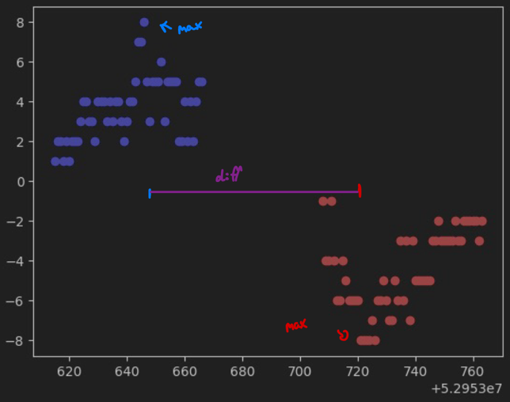
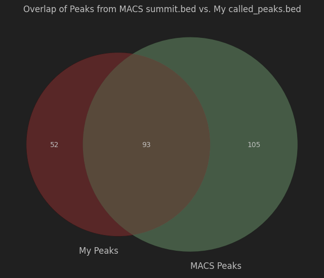

# ChIP-seq peak-caller
Own approach on a **very basic** peak-caller for CHiP-seq data!

## How it works
1) Setup an env with the following packages:
- pysam
- scipy
- numpy

2) Get your alignment file (SAM) and convert it to BAM (eg. With samtools), sort the BAM and index it! (.bai is necessary!)

3) start the script and hand the .bam file path to `--BAM_path / -p`

## My implementation of a peak caller
### data structure:
As data structure I chose a nested dictionary with
chromosomes as keys, then another dictionary with the read_direction as key and then another dictionary with positions 
as key and the coverage of this position as value

`dic[chromosome][read_direction][position] = coverage`

this way I could easily loop over the chromosomes and read_directions.

### finding peaks:
I used a fixed window-size that moved over the positions in the BAM file while checking if every
position in this window is contiguous and if the coverage is above the average coverage.

If the window is above the average coverage, the window got expanded by 1 until the next position that
was not above the average coverage anymore. This way I could find the peaks in the BAM file.

### filtering peaks:
Then I used a poisson modell to filter significant peaks.

### finding pairs of peaks:
Finally, I searched for pairs of keys that have their position of their maximum coverage within a specific range.
the difference between those max was set to 200. So each peak max that was out of this distance to another peak max was not considered a pair.
this was done by looping over the forward peaks and compare each of those with all reverse peaks.

(In this picture the reverse peak count was pictured as "negative" for visualization purposes only)

## Results
I used the given test data set to test my implementation by first aligning the ChIP-seq data to the mouse
genome with bowtie2:  
`bowtie2-build bowtie_index/mm10.fa bowtie_index/mm10`  
then sorting the output .bam file with samtools and finally running MACS3 with:  
`macs3 callpeak -t Oct4.sorted.bam -f BAM -g mm -n Oct4 -q 0.01`
to get the summits.bed file.

I used my CompareBED script to visualize my findings with that of MACS:

Which shows that nearly 66% of my peaks are also found by MACS. 
But nearly the same amount of peaks slipped through and was only found by MACS.
Using MACS as "True positives" my implementation has the following stats:
- Sensitivity: 0,4696969697
- Specificity: 0,6413793103  

(since I have no number true negatives accuracy and precision are not calculable)